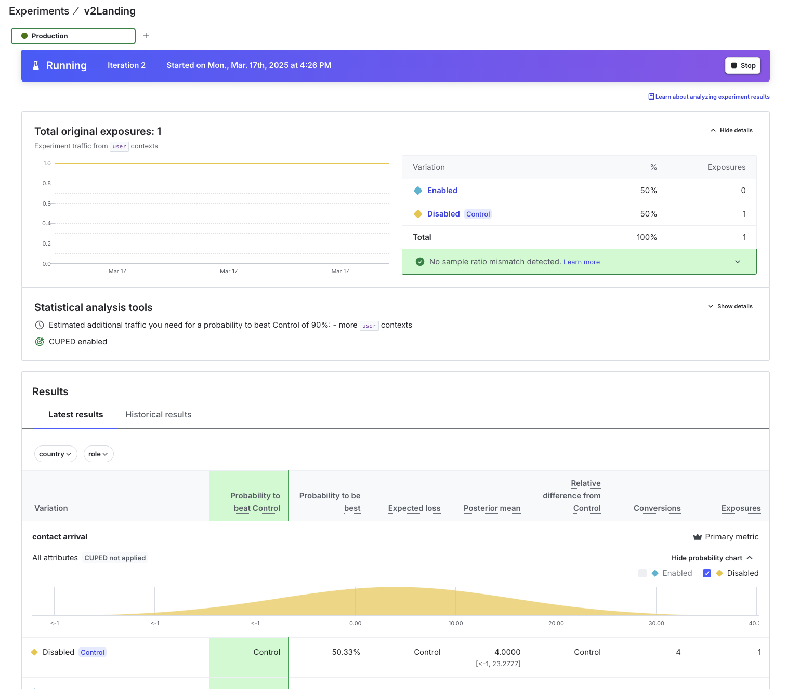

## Getting Started

- git clone https://github.com/jprix/empower-fe-js.git

- in root project directory, run `npm install`
- create a `.env` file in root directory of project
- paste in the below (values submitted separately)

```bash
NEXT_PUBLIC_LD_CLIENT_ID={{launchDarlkly client iID}}
LD_CLIENT_ID={{launchDarlkly client iID}}
LD_API_KEY={{launchDarlkly API KEY}}
LD_PROJECT_KEY=default
NEXT_PUBLIC_LD_PROJECT_KEY=default
NEXT_PUBLIC_LD_API_KEY={{launchDarlkly client iID}}
```

#### Run the App:

```bash
npm run dev
# or
yarn dev
```

Open [http://localhost:3000](http://localhost:3000) with your browser to see the result.

#### Part 1 Release and Remediate:

- Created a speak-with-specialist flag to show a new way of enrollment.
- Instant releases/rollbacks: This is solved via useFlags() context. The speak-with-specialist flag is shown based on a ternary expression- if turned on, we will hide ‘Check my Rate’ static form and show an option to speak with a live specialist.
- Remediate: Built admin page with REST Patch API call to allow for custom control on a 3rd party app (page requires admin role in user context).

#### Part 2 Target:

- Created a new flag called “v2Landing”
- Context Attributes: Requires user context to be in US country and user value of: “user-1234”. To edit, modify key or country

```javascript
const userContext = {
  kind: "user",
  key: "user-1234", //change to any other value for v1Landing
  email: "admin@example.com",
  role: "admin",
  country: "US", // change to UK for v1Landing
  custom: {
    featureAccess: "admin", // with this role you can see /LaunchDarklyAdmin page.
  },
};
```

#### Part 3: Experimentation

- reused 'v2landing' flag
- Created a metric call 'contact arrival'



#### Part 4: Integrations

- connected vercel plugin
