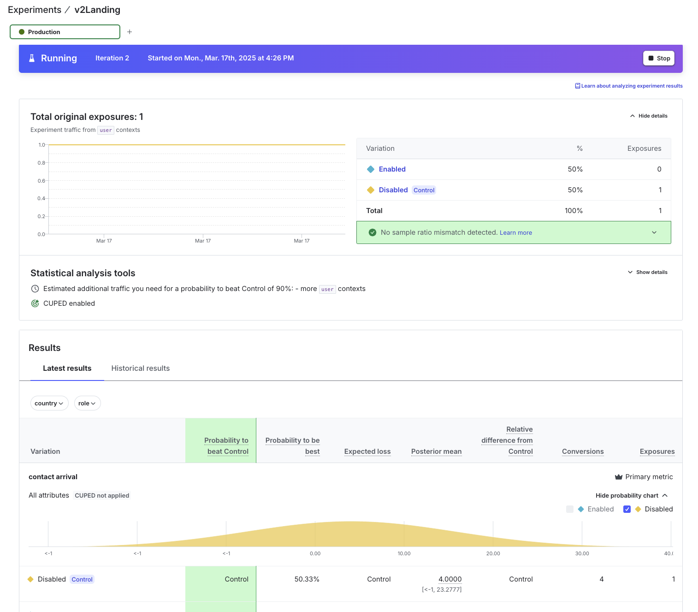

## Getting Started

- git clone https://github.com/jprix/empower-fe-js.git

- in root project directory, run `npm install`
- create a `.env` file in root directory of project
- add any app-specific environment variables as needed

#### Run the App:

```bash
npm run dev
# or
yarn dev
```

Open [http://localhost:3000](http://localhost:3000) with your browser to see the result.

#### Part 1

- Core landing and apply flow implementation.

#### Part 2

- Alternate landing concepts and UI iteration.

#### Part 3: Experimentation

- Created a metric call 'contact arrival'



#### Part 4: Integrations

- connected vercel plugin
